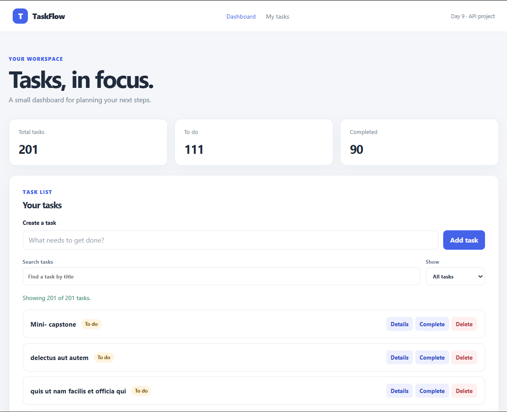

# TaskFlow API Dashboard

TaskFlow is a responsive task dashboard built with HTML, CSS, and vanilla JavaScript. It uses JSONPlaceholder todos to practice reading and changing data through a REST API.

## Features

- Fetch and display tasks from the API.
- View an individual task’s details.
- Create a task with a required title.
- Mark a task complete or reopen it.
- Delete a task.
- Search tasks by title and filter by status.
- See summary counts for all, open, and completed tasks.
- Get loading, success, empty, error, retry, and submitting feedback.
- Use the dashboard on desktop, tablet, and mobile screens.

## Technologies

- HTML for semantic page structure and form controls.
- CSS for the responsive layout and visual design.
- Vanilla JavaScript with fetch, async/await, DOM updates, and array methods.
- JSONPlaceholder for mock REST API data.

## API

The dashboard reads and writes the /todos resource at:

https://jsonplaceholder.typicode.com/todos

It uses GET to load tasks and individual task details, POST to create a task, PATCH to change its completion state, and DELETE to remove it.

JSONPlaceholder simulates write operations. A created, updated, or deleted task is reflected in the current page session, but the service does not permanently save the change. Reloading the page fetches the original sample data again.

## Run locally

The JavaScript uses ES modules to keep API functions in js/api.js separate from the page behavior in js/app.js. Run the page through a local web server:

1. Open the day9 folder in Visual Studio Code.
2. Start index.html with the Live Server extension.
3. The dashboard should load the todos. If a request fails, use the Retry loading button.

Opening index.html directly as a file URL may prevent the browser from loading the JavaScript module.

## Screenshots

Add a desktop and mobile screenshot of the running dashboard here. Save the images in a screenshots folder and embed them with Markdown, for example:

## Challenges and learning reflection

Suggested reflection to personalize before submission:

- **Challenge:** Keeping the loading, success, empty, and error messages in sync with asynchronous API requests.
- **What I learned:** How to use fetch with async/await, check response.ok, send JSON request bodies, and update the DOM after a response.
- **Next improvement:** Add confirmation before deleting a task or preserve local session changes in browser storage.
