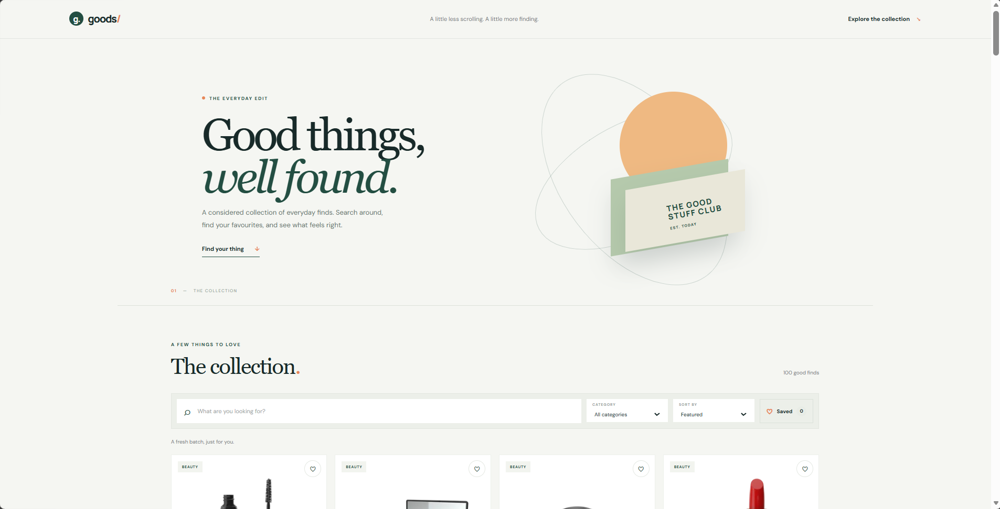
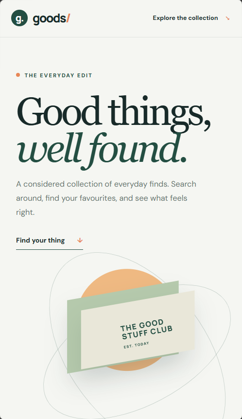

# Goods — Product Explorer

A responsive product discovery app built with HTML, CSS, and vanilla JavaScript. It loads real product data and lets you search, filter, sort, inspect product details, and save favourites in your browser.

## Features

- Loads product data from the [DummyJSON products API](https://dummyjson.com/docs/products).
- Checks HTTP response status and shows a retryable error state when loading fails.
- Builds product cards from API data, including an image, title, category, rating, and price.
- Searches product names and filters by category.
- Sorts prices low-to-high or high-to-low.
- Opens an accessible details dialog for a product.
- Saves favourites in `localStorage`, with a view for saved products.
- Shows loading, error, and empty results states.
- Adapts to desktop, tablet, and mobile screens and respects reduced-motion preferences.

## Project structure

```text
product-explorer/
├── index.html
├── css/styles.css
├── js/
│   ├── api.js       # Fetches and validates product data
│   ├── app.js       # State, events, filtering, and app behaviour
│   ├── storage.js   # Reads and writes saved favourites
│   └── ui.js        # Creates product cards and detail views
├── assets/
├── screenshots/
└── README.md
```

## Run locally

1. Open the repository in Visual Studio Code.
2. Open `product-explorer/index.html` with Live Server or another local HTTP server.
3. Keep an internet connection available so the browser can contact DummyJSON and load product images.

ES modules are used, so opening the file directly with a `file://` URL may be blocked by the browser.

## How the data becomes a page

When the page loads, `app.js` calls `getProducts()` in `api.js`. That function sends a `GET` request to `https://dummyjson.com/products?limit=100`, checks `response.ok`, then reads the JSON product array. `app.js` stores that array, prepares the category menu, and asks `ui.js` to create DOM elements for each visible product. Search, filters, sorting, and favourites change which products `app.js` passes to the renderer. `storage.js` keeps favourite product IDs in this browser's `localStorage` so they remain after a reload.

## Validation performed

- `node --check` passed for all four JavaScript modules.
- The live products endpoint returned HTTP 200 and 100 products.
- Mocked checks passed for product response validation, HTTP errors, favourite storage, product card actions, filtering, price sorting, details, and retrying after an API error.
- Manual browser checks were completed in Microsoft Edge: the products request returned HTTP 200 with product data, and the 3G throttled loading state and responsive layouts were reviewed. The browser screenshots are included below.

## Browser testing checklist

- [x] Load the collection successfully and inspect the request in DevTools Network.
- [x] Temporarily use an invalid API URL, then confirm the error message and retry control appear; restore the correct URL afterward.
- [x] Throttle the network in DevTools and check that the loading state is visible.
- [x] Search for a product name and for a name that does not exist.
- [x] Filter by a category and try both price sort directions.
- [x] Add and remove a favourite, reload the page, and verify localStorage behaviour.
- [x] Open product details and close with the button and Escape.
- [x] Check the Console and test desktop, tablet, and mobile widths.
- [x] Inspect the API request URL, method, status, and JSON response in Network.

## Screenshots

### Desktop



### Mobile



Original captures: [desktop](./screenshots/deskstop.png) · [mobile](./screenshots/mobile.png).

## Learning reflection

Before submission, write this section in your own words: the biggest challenge you worked through, what you learned about API data and browser storage, and one improvement you would make with more time.

## Known limitations

- The app needs an internet connection to load the product collection and remote product images.
- Favourites are stored in the current browser only; they do not sync across devices.
- If browser storage is blocked or full, the product explorer still works, but it cannot preserve favourite changes after a refresh.
